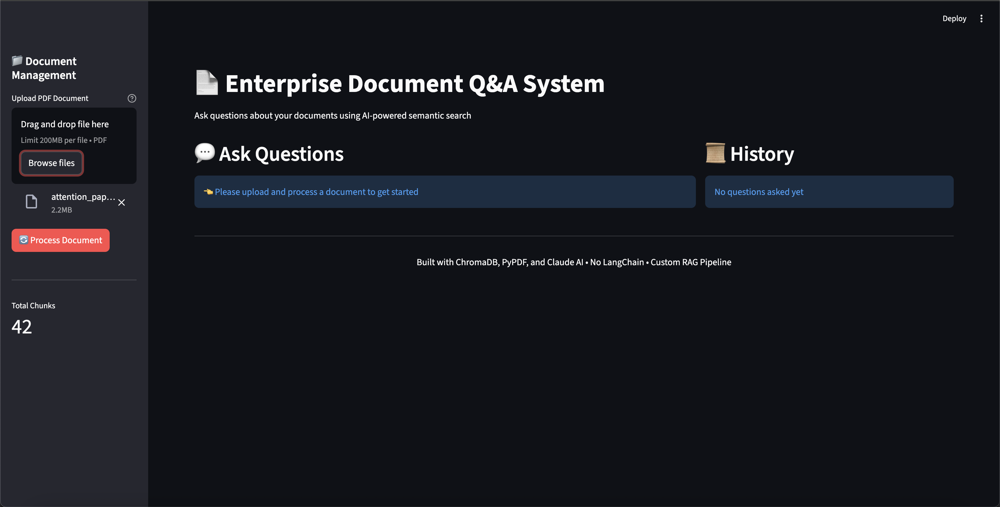
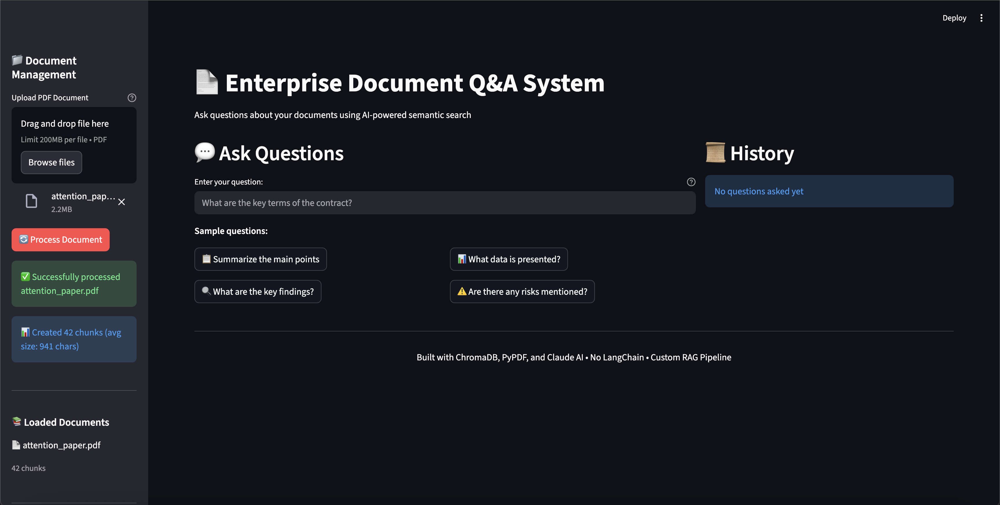
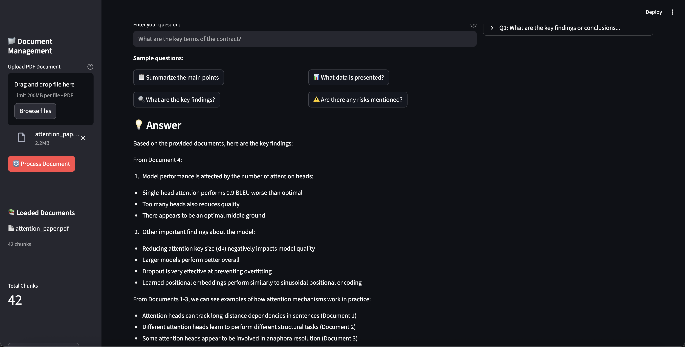
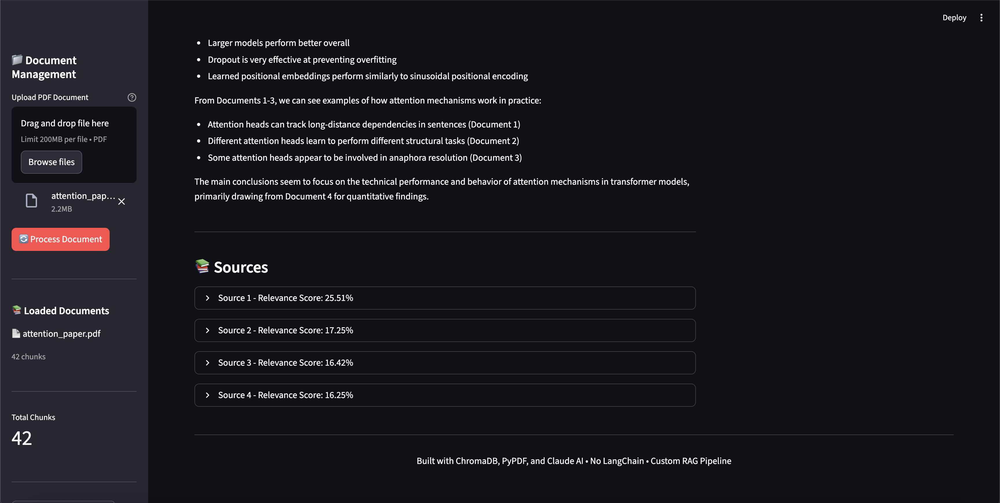

# Enterprise Document Q&A System

A lightweight RAG (Retrieval-Augmented Generation) system built from scratch without LangChain. Enables semantic search and intelligent question-answering over document collections using Claude AI and ChromaDB.


## 🚀 Live Demo
> **Coming Soon**: Deploy link will be added after initial deployment

<!-- Uncomment after deployment:
Try it now: [https://your-app.streamlit.app](https://your-app.streamlit.app)
-->

## Screenshots

### Document Upload Interface


### File Processing


### Query & AI-Powered Answers


### Source Citations with Relevance Scores


## Why I Built This

I built this while exploring production RAG patterns for enterprise applications. Every company is racing to unlock knowledge trapped in documents, and I wanted to understand the full stack—from chunking strategies to deployment—**without relying on heavy frameworks like LangChain**.

**Key learnings:**
- Chunking strategies significantly impact retrieval quality
- Source citation is critical for enterprise trust
- Direct API integration gives better control than abstraction layers
- Proper error handling matters more than perfect embeddings

**What this demonstrates:**
- Production-ready RAG from scratch (no LangChain)
- Custom chunking and retrieval pipeline
- Direct Claude API integration
- Clean, maintainable code patterns
- End-to-end deployment with Docker

## Features

- 📄 **PDF Document Processing**: Upload and index PDF documents
- 🔍 **Semantic Search**: Find relevant information using natural language
- 🤖 **AI-Powered Answers**: Get accurate responses backed by your documents
- 📎 **Source Citations**: See exactly which documents and pages informed each answer
- 🎯 **Relevance Scoring**: Understand confidence levels for retrieved information
- 🚀 **Fast Retrieval**: Optimized vector search with ChromaDB

## Architecture

**Custom RAG Pipeline (No LangChain)**

```
┌─────────────┐
│   User      │
│   Query     │
└──────┬──────┘
       │
       ▼
┌──────────────────────────────────────┐
│      Streamlit UI Layer              │
└──────┬───────────────────────────────┘
       │
       ▼
┌──────────────────────────────────────┐
│   Custom RAG Pipeline                │
│                                      │
│  ┌──────────┐    ┌──────────────┐  │
│  │ PyPDF    │───▶│ Custom       │  │
│  │ Loader   │    │ Chunker      │  │
│  └──────────┘    └──────┬───────┘  │
│                         │           │
│                         ▼           │
│              ┌──────────────────┐  │
│              │  ChromaDB        │  │
│              │  (embeddings +   │  │
│              │   vector store)  │  │
│              └──────────┬───────┘  │
│                         │           │
│         ┌───────────────┴──────┐   │
│         ▼                      │   │
│  ┌──────────────┐             │   │
│  │  Semantic    │             │   │
│  │  Search      │             │   │
│  │  (Top-K)     │             │   │
│  └──────┬───────┘             │   │
│         │                     │   │
│         ▼                     │   │
│  ┌──────────────┐             │   │
│  │  Direct      │             │   │
│  │  Claude API  │◀────────────┘   │
│  └──────┬───────┘                 │
└─────────┼───────────────────────┘
          │
          ▼
     ┌─────────┐
     │ Answer  │
     │   +     │
     │ Sources │
     └─────────┘
```

## Tech Stack

| Component | Technology | Purpose |
|-----------|------------|---------|
| **LLM** | Claude 3.5 Sonnet | Response generation |
| **Vector Store** | ChromaDB | Semantic search & embeddings |
| **Document Processing** | PyPDF | PDF text extraction |
| **UI** | Streamlit | Web interface |
| **Language** | Python 3.11+ | Core implementation |

**Note:** Built without LangChain - direct API integration for full control and minimal dependencies.

## Quick Start

### Prerequisites

- Python 3.11 or higher
- Anthropic API key ([Get one here](https://console.anthropic.com/))
- (Optional) Voyage AI or OpenAI API key for embeddings

### Installation

1. **Clone the repository**
   ```bash
   git clone https://github.com/yourusername/enterprise-doc-qa.git
   cd enterprise-doc-qa
   ```

2. **Create virtual environment**
   ```bash
   python -m venv venv
   source venv/bin/activate  # On Windows: venv\Scripts\activate
   ```

3. **Install dependencies**
   ```bash
   pip install -r requirements.txt
   ```

4. **Configure environment variables**
   ```bash
   cp .env.example .env
   # Edit .env and add your API keys
   ```

5. **Run the application**
   ```bash
   streamlit run src/ui/app.py
   ```

6. **Open your browser**
   Navigate to `http://localhost:8501`

## Docker Deployment

```bash
# Build the image
docker build -t doc-qa-system .

# Run the container
docker run -p 8501:8501 --env-file .env doc-qa-system
```

## Usage

### Sample Questions to Try

Once you've uploaded documents, try questions like:

- "What are the key terms of the contract?"
- "Summarize the main findings from the research report"
- "What security measures are mentioned?"
- "Compare the pricing models discussed"
- "What are the project timelines?"

### Best Practices

**For best results:**
- Upload well-structured PDFs (avoid scanned images without OCR)
- Keep documents focused on a specific domain
- Ask specific questions rather than broad queries
- Review source citations to verify accuracy

## Project Structure

```
enterprise-doc-qa/
├── src/
│   ├── components/
│   │   ├── document_loader.py    # PDF processing
│   │   ├── chunking.py            # Text splitting logic
│   │   ├── embeddings.py          # Vector generation
│   │   └── retrieval.py           # RAG chain implementation
│   └── ui/
│       └── app.py                 # Streamlit interface
├── tests/
│   ├── test_chunking.py
│   └── test_retrieval.py
├── data/                          # Sample documents (gitignored)
├── docs/                          # Additional documentation
├── .env.example                   # Environment template
├── .gitignore
├── requirements.txt
├── Dockerfile
└── README.md
```

## Configuration

Key environment variables in `.env`:

```bash
# Required
ANTHROPIC_API_KEY=your_claude_api_key

# Optional (for embeddings)
VOYAGE_API_KEY=your_voyage_key
OPENAI_API_KEY=your_openai_key

# Tuning parameters
CHUNK_SIZE=1000
CHUNK_OVERLAP=200
TOP_K_RESULTS=4
```

## Limitations & Future Improvements

### Current Limitations
- PDF only (no DOCX, TXT, HTML yet)
- No multi-document comparison
- Chat history not persisted across sessions
- English language only

### Roadmap
- [ ] Add support for DOCX, TXT, Markdown files
- [ ] Implement conversation memory
- [ ] Add authentication and multi-user support
- [ ] Hybrid search (keyword + semantic)
- [ ] Export Q&A history
- [ ] Advanced chunking strategies (semantic splitting)
- [ ] Custom embedding fine-tuning

## Testing

```bash
# Run all tests
pytest

# Run with coverage
pytest --cov=src tests/

# Run specific test file
pytest tests/test_chunking.py
```

## Performance

**Benchmarks** (on M1 Mac, 100-page PDF):
- Document processing: ~15 seconds
- Query response time: ~2-3 seconds
- Embedding generation: ~5 seconds (cached afterward)

## Contributing

Contributions welcome! Please:
1. Fork the repository
2. Create a feature branch (`git checkout -b feature/amazing-feature`)
3. Commit your changes (`git commit -m 'Add amazing feature'`)
4. Push to the branch (`git push origin feature/amazing-feature`)
5. Open a Pull Request

## License

MIT License - see [LICENSE](LICENSE) file for details

## Acknowledgments

- Powered by [Anthropic Claude](https://www.anthropic.com/)
- Vector search by [ChromaDB](https://www.trychroma.com/)
- PDF processing by [PyPDF](https://pypdf.readthedocs.io/)
- UI framework by [Streamlit](https://streamlit.io/)

## Contact

**Sandeep Uppalapati**
- LinkedIn: [linkedin.com/in/sandeep-uppalapati](https://linkedin.com/in/sandeep-uppalapati)
- GitHub: [@sandeepuppalapati](https://github.com/sandeepuppalapati)
- Project: [github.com/sandeepuppalapati/enterprise-doc-qa](https://github.com/sandeepuppalapati/enterprise-doc-qa)

---

**Note**: This is a demonstration project. For production use, add proper authentication, rate limiting, and security measures.
